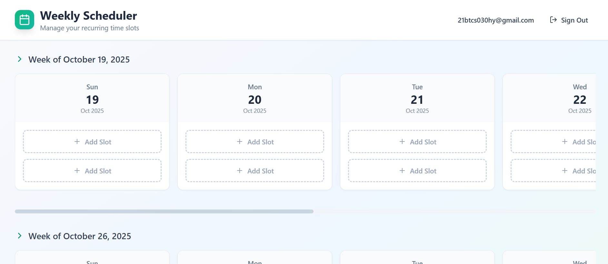

# Weekly Scheduler with Recurring Slots

A beautiful, production-ready scheduler system built with React, TypeScript, Tailwind CSS, and Supabase. This application allows users to create recurring weekly time slots with intelligent exception handling for date-specific modifications.

   

## 🖼️ Demo 

### SignUp Page
<p align="center">
  
</p>

### SignIn  Page
<p align="center">
  
</p>

### Dashboard Page
<p align="center">
  
  
</p>


---

## Features

### Core Functionality
- **Recurring Weekly Slots**: Create time slots that automatically repeat every week on the same day
- **Maximum 2 Slots Per Day**: Each date can contain up to 2 time slots
- **Smart Exception Handling**: Edit or delete specific dates without affecting other occurrences
- **Infinite Scroll**: Seamlessly load future weeks as you scroll down
- **Real-time Updates**: Changes reflect immediately across all weeks

### User Experience
- **Beautiful Modern Design**: Clean, professional interface with emerald/teal color scheme
- **Today Indicator**: Special highlighting for the current date
- **Responsive Layout**: Works perfectly on mobile, tablet, and desktop
- **Smooth Animations**: Polished transitions and micro-interactions
- **Interactive Slot Cards**: Hover to reveal edit and delete actions
- **Intuitive Modals**: Clear dialogs for creating, editing, and deleting slots

## Technology Stack

- **Frontend**: React 18.3 + TypeScript 5.5
- **Styling**: Tailwind CSS 3.4 with custom utilities
- **Database**: Supabase (PostgreSQL)
- **Icons**: Lucide React
- **Build Tool**: Vite 5.4
- **Deployment Ready**: Optimized for Vercel/Netlify

## Database Architecture

### Tables

#### `recurring_slots`
Stores the base recurring slot patterns that repeat weekly.

| Column | Type | Description |
|--------|------|-------------|
| id | uuid | Primary key |
| day_of_week | integer | Day of week (0=Sunday, 6=Saturday) |
| start_time | time | Start time of the slot |
| end_time | time | End time of the slot |
| created_at | timestamptz | Creation timestamp |
| updated_at | timestamptz | Last update timestamp |

#### `slot_exceptions`
Tracks exceptions to recurring slots (edits or deletions on specific dates).

| Column | Type | Description |
|--------|------|-------------|
| id | uuid | Primary key |
| recurring_slot_id | uuid | Foreign key to recurring_slots |
| exception_date | date | Specific date this exception applies to |
| exception_type | text | 'deleted' or 'modified' |
| start_time | time | Modified start time (nullable) |
| end_time | time | Modified end time (nullable) |
| created_at | timestamptz | Creation timestamp |

### Security
- Row Level Security (RLS) enabled on all tables
- Public access policies for demo purposes (customize for production)
- Cascading deletes to maintain data integrity

## Getting Started

### Prerequisites
- Node.js 18+ and npm
- Supabase account and project

### Installation

1. **Clone the repository**
   ```bash
   git clone <repository-url>
   cd project
   ```

2. **Install dependencies**
   ```bash
   npm install
   ```

3. **Set up environment variables**

   The `.env` file should already contain your Supabase credentials:
   ```env
   VITE_SUPABASE_URL=your-supabase-url
   VITE_SUPABASE_ANON_KEY=your-supabase-anon-key
   ```

4. **Database setup**

   The database migrations are already applied. Your Supabase instance should have:
   - `recurring_slots` table
   - `slot_exceptions` table
   - Proper indexes and RLS policies

5. **Start the development server**
   ```bash
   npm run dev
   ```

6. **Build for production**
   ```bash
   npm run build
   ```

## Usage Guide

### Creating a Recurring Slot

1. Click the "Add Slot" button on any day
2. Select start and end times
3. Click "Create Slot"
4. The slot will automatically appear on the same day of every week

### Editing a Slot

1. Hover over any slot card
2. Click the edit (pencil) icon
3. Modify the times as needed
4. Click "Save Changes"
5. Only that specific date will be modified (other occurrences remain unchanged)

### Deleting a Slot

1. Hover over any slot card
2. Click the delete (trash) icon
3. Confirm the deletion
4. Only that specific date will be deleted (other occurrences remain unchanged)

### Loading More Weeks

Simply scroll down to automatically load future weeks using infinite scroll.

## Project Structure

```
src/
├── components/
│   ├── DayColumn.tsx          # Individual day column display
│   ├── SlotCard.tsx           # Slot card with actions
│   ├── SlotModal.tsx          # Create/edit slot modal
│   └── DeleteModal.tsx        # Delete confirmation modal
├── lib/
│   └── supabase.ts            # Supabase client and types
├── services/
│   └── schedulerService.ts    # Business logic and API calls
├── App.tsx                     # Main application component
├── index.css                   # Global styles and animations
└── main.tsx                    # Application entry point

supabase/
└── migrations/
    └── 20251023050238_create_scheduler_tables.sql
```

## Key Implementation Details

### Recurring Logic

The system uses a smart approach to handle recurring slots:

1. **Base Pattern**: Each slot is stored with a day of week (0-6)
2. **Week Generation**: When loading a week, the system queries all recurring slots
3. **Exception Overlay**: For each date, it checks if there are any exceptions
4. **Final Rendering**: Deleted exceptions are hidden, modified exceptions show updated times

### Exception Handling

When a user edits or deletes a slot:

- An exception record is created for that specific date
- The `exception_type` is set to 'modified' or 'deleted'
- The original recurring slot remains unchanged
- All other dates continue to use the base pattern

### Performance Optimizations

- Indexes on frequently queried columns
- Week-based data loading to reduce payload
- Local state caching to avoid redundant API calls
- Intersection Observer for efficient infinite scroll

## Deployment

### Frontend (Vercel/Netlify)

1. Connect your Git repository
2. Set build command: `npm run build`
3. Set output directory: `dist`
4. Add environment variables from `.env`

### Database (Supabase)

The database is already provisioned and configured. Ensure:
- Migrations are applied
- RLS policies are active
- Connection pooling is enabled for production

## Customization

### Color Scheme

The app uses an emerald/teal color scheme. To change:

1. Update gradient classes in components:
   - `from-emerald-500 to-teal-500` → your colors
2. Update hover states and borders accordingly

### Time Format

To change from 12-hour to 24-hour format:

1. Edit `SchedulerService.formatTime()` in `schedulerService.ts`
2. Remove AM/PM logic and return raw time

### Maximum Slots Per Day

To change the 2-slot limit:

1. Update the check in `App.tsx` handleSaveSlot function
2. Update UI logic in `DayColumn.tsx`

## API Reference

### SchedulerService

#### `getRecurringSlots()`
Fetches all recurring slot patterns.

#### `getSlotsForWeek(weekStart: Date)`
Returns a map of dates to slots for the specified week, with exceptions applied.

#### `createRecurringSlot(dayOfWeek, startTime, endTime)`
Creates a new recurring slot pattern.

#### `updateSlotForDate(recurringSlotId, date, startTime, endTime)`
Creates an exception to modify a slot on a specific date.

#### `deleteSlotForDate(recurringSlotId, date)`
Creates an exception to delete a slot on a specific date.

## License

MIT License - Feel free to use this project for learning and development.

## Support

For issues or questions:
- Check the code comments for inline documentation
- Review the database schema in migrations
- Examine the service layer for business logic

## Acknowledgments

Built as a demonstration of modern full-stack development practices with React, TypeScript, and Supabase.

---

**Made with ❤️ using React, TypeScript, Tailwind CSS, and Supabase**
"# Weekly-Scheduler" 
